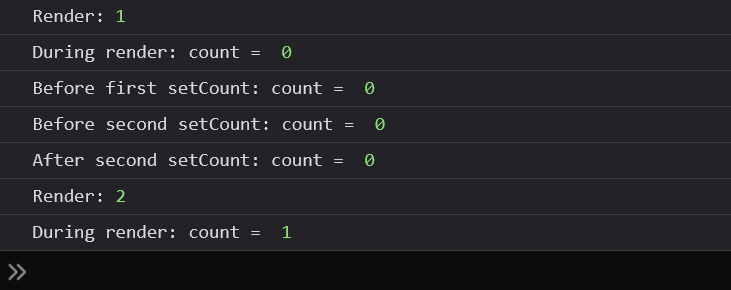
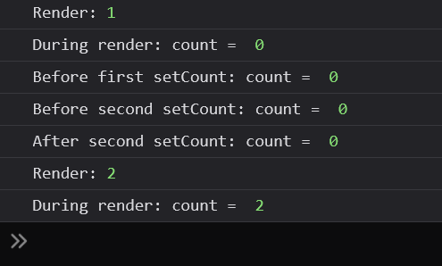
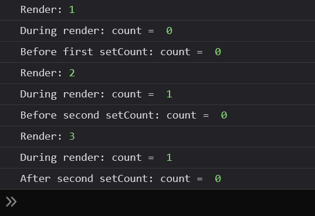
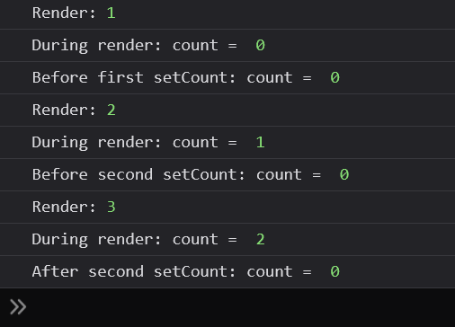
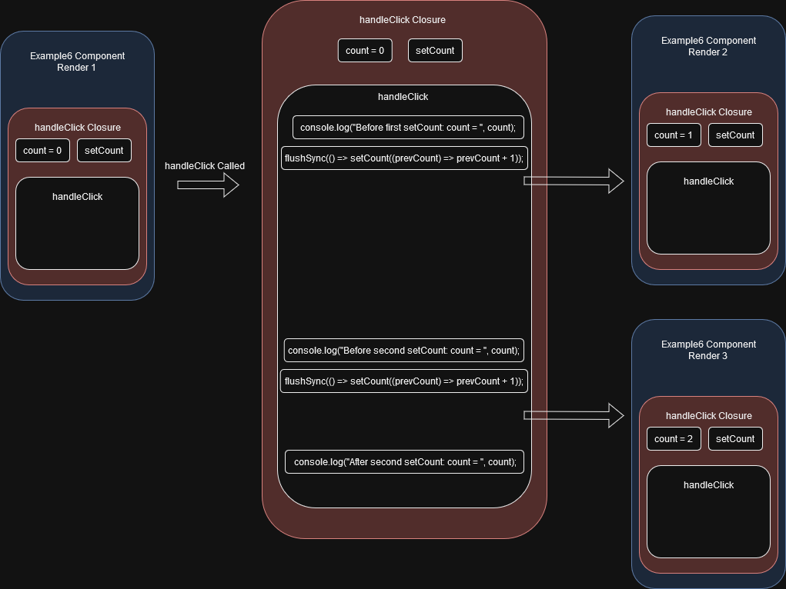

# Automatic Batching behvaiour of useState in React 18

The `useState` hook, probably the most commonly used react hook, has some quirks that might trip up new users. This article is my attempt at explaining some things that had confused me when I was first learning about useState.

## The Basics

Treat this section as the basecamp in **'Makes Sense Valley'** , from where we shall venture out to conquer the **'Quirky Peaks'** of the **'WTF JS Ranges'**.

### Simple Example

```jsx
import React, { useState } from "react";

// Example 1: Simple Use Case
const Example1 = () => {
  const [text, setText] = useState("This Makes Sense");

  return (
    <>
      <h1>{text}</h1>
      <button onClick={() => setText("Still Makes Sense")}>Update State</button>
    </>
  );
};

export default Example1;
```

We set up a state for our component using the useState hook. The initial state is a string with the value of "This Makes Sense" and on a click of the 'Update State' button, that state is updated to another string with the value of "Still Makes Sense". As simple as it gets.

### State Updates Trigger Re-Renders, But Not Always

In the following code, we have a component with a state set up with an inital value of an empty string. Clicking the 'Yes' button sets the state to the string "Yes". Similarly, clicking the 'No' button, sets the state to the string, "No".
The important bit here is that every time the component is rendered, i.e. the component function is called, we increase the value of the global variable `render` and log it to the console. This way we can detect when the component is being rendered.

Now, try this:
Click "Yes" -> Console shows that a second render has taken place.
Click "No" -> Console shows that a third render has taken place.
Click "No" again -> A fourth render? Why though?

React is not supposed to render if the state is being set to the same value, right?

Click "No" again -> Voila! No renders.

Well, even if the new state value and the existing state value are the same, sometimes React needs to render the component once before [bailing out](https://legacy.reactjs.org/docs/hooks-reference.html#bailing-out-of-a-state-update). That's just how useState behaves.

> I have not found any further explanation of why this happens exactly and would greatly appreciate any
> resources that throw light on this behaviour.

```jsx
import React, { useState } from "react";

// Example 2: State Updates Trigger Re-Renders
let render = 0;

const Example2 = () => {
  const [answer, setAnswer] = useState("");

  const handleYesClick = () => {
    setAnswer("Yes");
  };

  const handleNoClick = () => {
    setAnswer("No");
  };

  render++;
  console.log("render: ", render);
  return (
    <>
      <hr />
      <h4>Example 2: State Updates Trigger Re-Renders</h4>
      <h1>Does This Make Sense? {answer}</h1>
      <button onClick={handleYesClick}>Yes</button>
      <button onClick={handleNoClick}>No</button>
      <hr />
    </>
  );
};

export default Example2;
```

### State Updates Are Automatically Batched

In general, if you have multiple state updates one after the other, they will not trigger re-renders after each one. Instead, the updates will be grouped (i.e. batched) together and only one re-render will trigger. This has performance benefits.

In the following code, even though there are 2 state updates within each of the click handlers, there will be only one re-render triggered for each button click.

Note: React 17 and below behave the same for React event handlers but do not batch state updates for promises, setTimeout calls, native event handlers, or any other event.

> [React 18: Automatic Batching Blog post](https://react.dev/blog/2022/03/29/react-v18#whats-new-in-react-18) > [React 18: Automatic Batching Github Discussion](https://github.com/reactwg/react-18/discussions/21)

```jsx
import React, { useState } from "react";

// Example 3: State Updates Are Automatically Batched
let render = 0;

const Example3 = () => {
  const [type, setType] = useState("");
  const [color, setColor] = useState("");

  const handlePetAClick = () => {
    setType("Dog");
    setColor("Black");
  };

  const handlePetBClick = () => {
    setType("Cat");
    setColor("White");
  };

  const handlePetCClick = () => {
    fetch("https://jsonplaceholder.typicode.com/todos/1").then((response) => {
      console.log("fetch complete");
      setType("Hamster");
      setColor("Brown");
    });
  };

  render++;
  console.log("E3 render: ", render);
  return (
    <>
      <hr />
      <h4>Example 3: State Updates Are Automatically Batched</h4>
      <h1>Pet Type: {type}</h1>
      <h1>Pet Color: {color}</h1>
      <button onClick={handlePetAClick}>Pet A</button>
      <button onClick={handlePetBClick}>Pet B</button>
      <button onClick={handlePetCClick}>Get Pet C</button>
      <hr />
    </>
  );
};

export default Example3;
```

That covers the basics before we head into the somewhat confusing behaviours.

## Onward To Quirkisthan

### Case 1: Naive attempt at multiple updates to a single state

In the following code, we just want to increment the `count` state twice on each click of the 'Increment' button. Doing it this way does not work.
If we run this code and click the 'Increment' button we'll see that on each click, `count` is only incremented by 1.

```jsx
import React, { useState } from "react";

// Example 4: Multiple updates to a single state

const Example4 = () => {
  const [count, setCount] = useState(0);

  const handleClick = () => {
    setCount(count + 1);
    setCount(count + 1);
  };

  return (
    <>
      <hr />
      <h4>Example 4: Naive attempt at multiple updates to a single state</h4>
      <h1>{count}</h1>
      <button onClick={handleClick}>Increment</button>
      <hr />
    </>
  );
};

export default Example4;
```

To visualize what's going on, we'll add a bunch of `console.log` statements all over the code. Like so...

```jsx
import React, { useState } from "react";

// Example 4: Multiple updates to a single state

let render = 0;

const Example4 = () => {
  const [count, setCount] = useState(0);

  render++;
  console.log("Render:", render);

  console.log("During render: count = ", count);

  const handleClick = () => {
    console.log("Before first setCount: count = ", count);
    setCount(count + 1);

    console.log("Before second setCount: count = ", count);
    setCount(count + 1);

    console.log("After second setCount: count = ", count);
  };

  return (
    <>
      <hr />
      <h4>Example 4: Naive attempt at multiple updates to a single state</h4>
      <h1>{count}</h1>
      <button onClick={handleClick}>Increment</button>
      <hr />
    </>
  );
};

export default Example4;
```

On clicking the 'Increment' button once, we get the following output in the console.
Note that the value of `count` does not change once the component has been rendered, until it is rendered again. This is not a React or a useState specific behaviour. This is [JavaScript Closures](https://www.freecodecamp.org/news/lets-learn-javascript-closures-66feb44f6a44/) in action.



Let's break it down,

1. Initial render
   1. useState hook called returning `count` variable and `setCount` function.
      - Both `count` and `setCount` are local to the component function (i.e. they are only accessible within the component function's scope).
      - Value of `count` is `0` (since initial state was set to `0`).
   2. `During render: count =  0` is logged out to console.
   3. 'Increment' button is clicked and `handleClick` function is called.
   4. `Before first setCount: count =  0` is logged out to console.
   5. `setCount` is called with argument as `1` ( since `count = 0`, `count + 1 = 0 + 1 = 1`).
   6. `Before second setCount: count =  0` is logged out to console.
   7. `setCount` is called with argument as `1` ( since `count = 0`, `count + 1 = 0 + 1 = 1`).
      - `handleClick` is an inner function with `Example4` functional component acting as the outer function.
      - `Example4`'s local variable (i.e. function scoped variable) `count` is used inside.`handleClick`
      - `handleClick` might need to run long after `Example4` has finished running but if `Example4` completes running `count` will no longer be kept in memory and in turn garbage collected.
      - `handleClick` needs to close over `count` forming a **closure** such that `handleClick` has access to a copy of `count` with the same value as when the closure was formed.
      - The closure was formed when `Example4` was run.
      - So, the value of `count` within `handleClick` does not change.
   8. `After second setCount: count =  0` is logged out to console.
   9. Only one re-render is triggered since both `setCount` calls are automatically batched.
2. Second Render
   1. useState hook called returning `count` variable and `setCount` function.
      - Value of `count` is `1` (although `setCount` was called twice, both calls set `count` to `1`).
   2. `During render: count =  1` is logged out to console.

### Case 2: Multiple state updates using previous state value

Just replacing the `setCount` calls in `Example4` with their alternatives which take a callback function as argument, gives us the behaviour we want. The callback itself takes the latest value the state as argument.

```jsx
import React, { useState } from "react";

// Example 5: Multiple state updates using previous state value

let render = 0;

const Example5 = () => {
  const [count, setCount] = useState(0);

  render++;
  console.log("Render:", render);

  console.log("During render: count = ", count);

  const handleClick = () => {
    console.log("Before first setCount: count = ", count);
    setCount((prevCount) => prevCount + 1);

    console.log("Before second setCount: count = ", count);
    setCount((prevCount) => prevCount + 1);

    console.log("After second setCount: count = ", count);
  };

  return (
    <>
      <hr />
      <h4>Example 5: Multiple state updates using previous state value</h4>
      <h1>{count}</h1>
      <button onClick={handleClick}>Increment</button>
      <hr />
    </>
  );
};

export default Example5;
```

The output:



The breakdown is identical with the key difference being in steps (5) and (7) where the state updates no longer depend on the value of `count` provided by the `handleClick` closure.
So, even though the value of `count` in `handleClick` remains the same, the `setCount` calls never actually use the value, instead relying on the latest value of the `count` state received as the callback's argument.  
However, state updates are still batched and there is still just one render even though `setCount` is called twice.

### Case 3: Multiple state updates without batching

To trigger a re-render for every state update instead of the default batching behaviour of state updates, we need to use `flushSync`.

Let's see how that works:

```jsx
import React, { useState } from "react";
import { flushSync } from "react-dom";

// Example 6: Multiple state updates without batching

let render = 0;

const Example6 = () => {
  const [count, setCount] = useState(0);

  render++;
  console.log("Render:", render);

  console.log("During render: count = ", count);

  const handleClick = () => {
    console.log("Before first setCount: count = ", count);
    flushSync(() => setCount(count + 1));

    console.log("Before second setCount: count = ", count);
    flushSync(() => setCount(count + 1));

    console.log("After second setCount: count = ", count);
  };

  return (
    <>
      <hr />
      <h4>Example 6: Multiple state updates without batching</h4>
      <h1>{count}</h1>
      <button onClick={handleClick}>Increment</button>
      <hr />
    </>
  );
};

export default Example6;
```

This snippet has the same pitfall that Case 1 had with `count` being set to `1` for both `setCount` calls but since we're using `flushSync`, the component re-renders after each state update instead of batching them.
Note that the `handleClick` function called from the initial render of the component is still running after the second and third re-renders. That explains the order of the console logs.



The following diagram might help visualize the process.


The key to actually incrementing `count` state twice is the same as in Case 2. Just pass a function to `setCount`.

```jsx
import React, { useState } from "react";
import { flushSync } from "react-dom";

// Example 7: Multiple state updates without batching

let render = 0;

const Example7 = () => {
  const [count, setCount] = useState(0);

  render++;
  console.log("Render:", render);

  console.log("During render: count = ", count);

  const handleClick = () => {
    console.log("Before first setCount: count = ", count);
    flushSync(() => setCount((prevCount) => prevCount + 1));

    console.log("Before second setCount: count = ", count);
    flushSync(() => setCount((prevCount) => prevCount + 1));

    console.log("After second setCount: count = ", count);
  };

  return (
    <>
      <hr />
      <h4>Example 7: Multiple state updates without batching</h4>
      <h1>{count}</h1>
      <button onClick={handleClick}>Increment</button>
      <hr />
    </>
  );
};

export default Example7;
```

Output:



Control Flow:



Now, we need to play around with the examples until we truly understand this behaviour.
